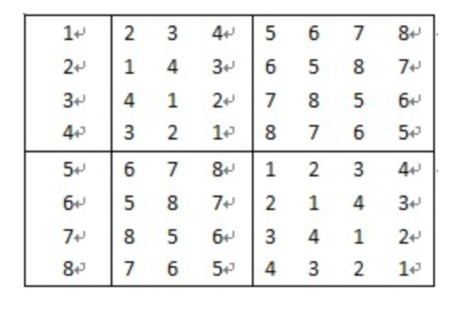

# This is my AL homework when I study at CSU.
1. 设围棋⽐赛有m=2p(p为正整数）位参赛者。现要设计⼀个满⾜以下
   要求的循环⽐赛⽐赛⽇程表：

   (1)每位选⼿必须与其他m-1位选⼿各赛⼀次；

   (2)每位选⼿⼀天只能参赛⼀次；

   (3)循环赛在m-1天内结束。

   请按此要求将⽐赛⽇程表设计成有m⾏和m-1列的表格。在表中的第i⾏，第j列处填⼊第i个选⼿在第j天所遇到的选⼿。其中1≤i≤n，1≤j≤n-1。

   8个选⼿的⽐赛⽇程表如下图所示：

2. ⽤两台机器加⼯10个零件。这⾥既不能将⼀个零件分开由2台机器处
   理，也没有⼀台机器能同时处理2个零件。这10个零件交给第⼀台机器
   处理需要时间为[1 3 5 7 4 2 8 4 9 9]，交给第⼆台机器处理需要时间
   [1.5 2 6 8 2 1 3 8 11 4]。这⾥假设两台机器都连续⼯作，没有休息时间，
   请设计⼀个动态规划算法，使得这两台机器处理完这10个零件的时间最
   短，并显示两台机器所处理零件的具体顺序。

3. 给定n位正整数a，去掉其中任意k个数字后，剩下的数字按原次序排
   列组成⼀个新的正整数。对于给定的n和k，设计⼀个算法，找出剩下数
   字组成的新数最⼩值的删数⽅案。

4. ⽤回溯算法求解任意的9*9的数独问题。（数独问题描述：标准的数
   独游戏是在⼀个 9 X 9 的棋盘上填写 1 – 9 这 9 个数字，规则是这样
   的：棋盘分成下图所示的 9 个区域（不同区域由⿊⾊粗线标出，每个区
   域是 3 X 3 的⼦棋盘），在每个⼦棋盘中填充 1 – 9 且不允许重复 ，下
   ⾯简称块重复每⼀⾏不许有重复值，每⼀列不许有重复值）